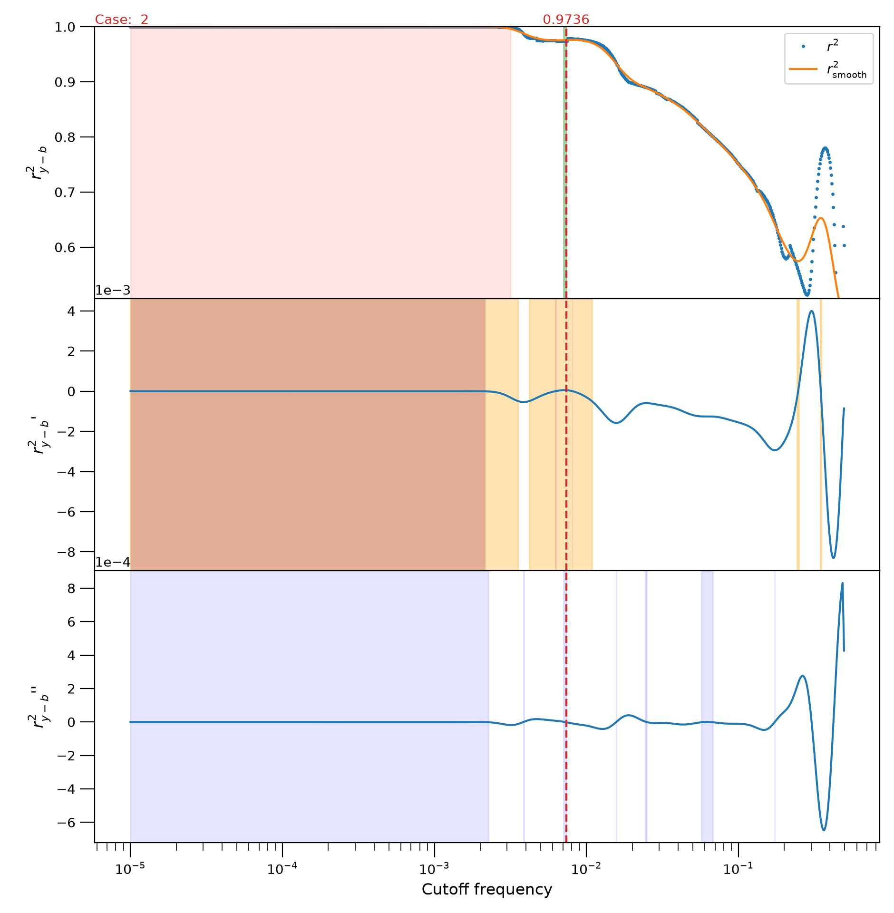
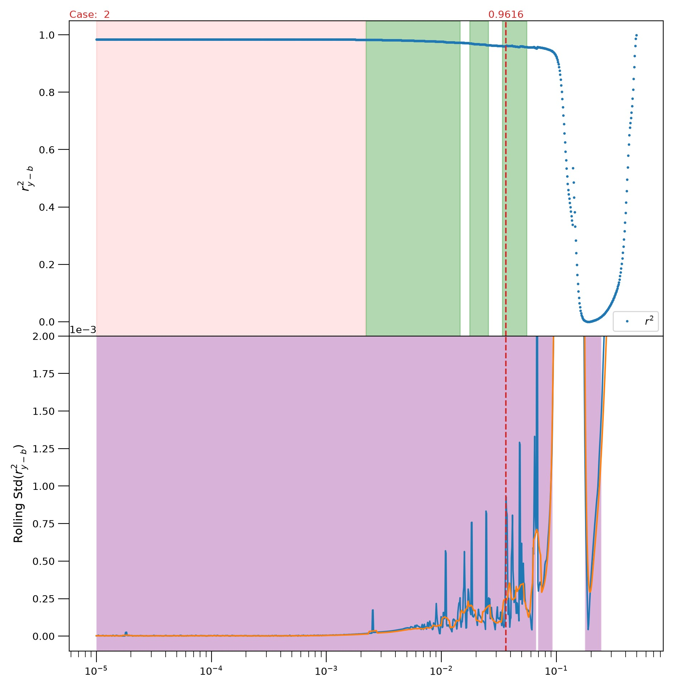
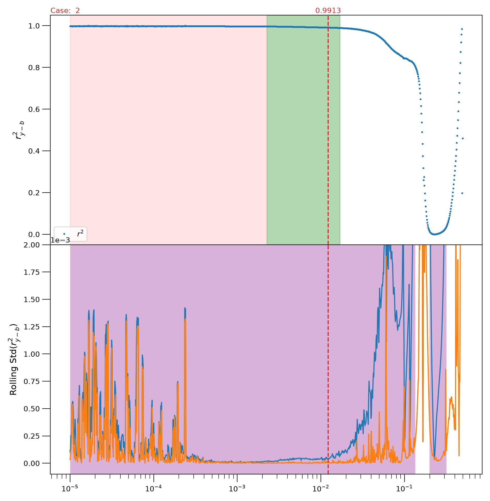
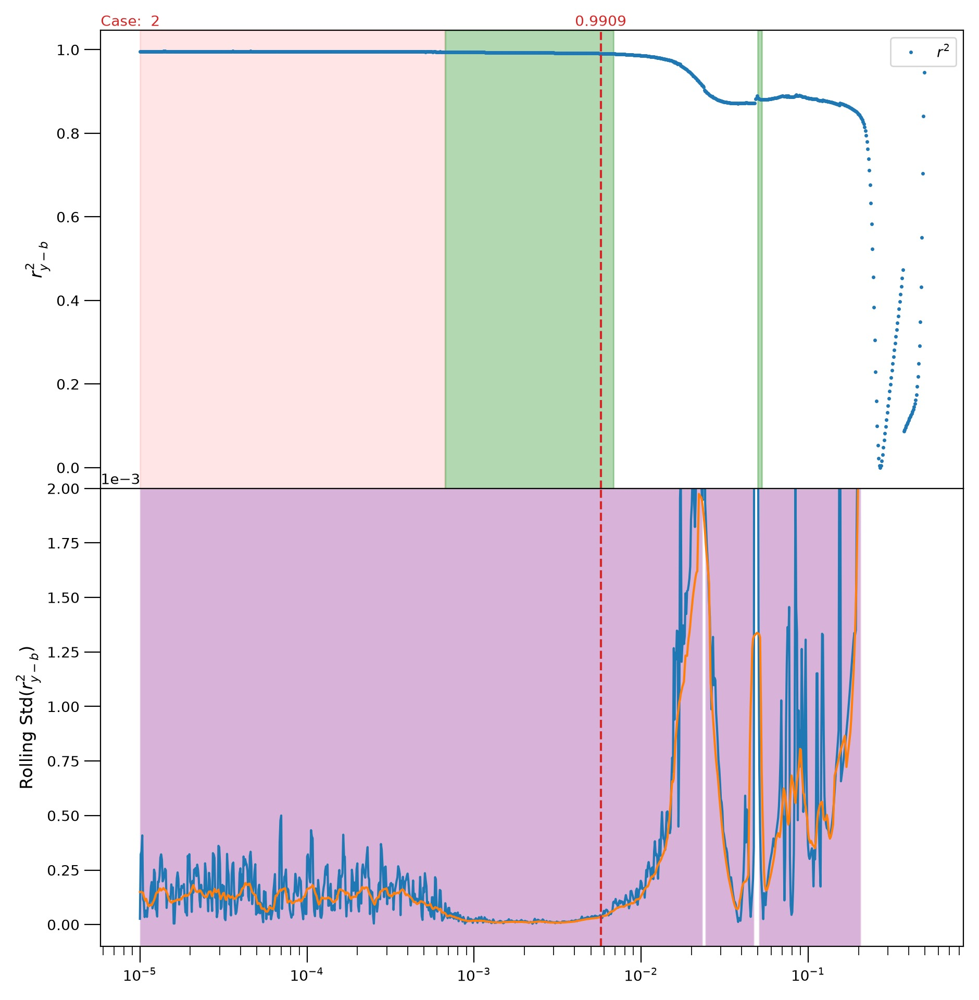
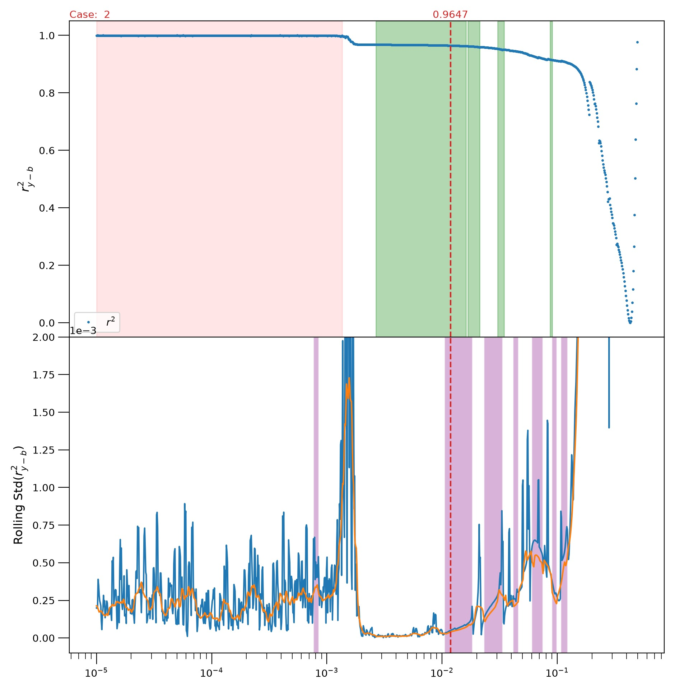
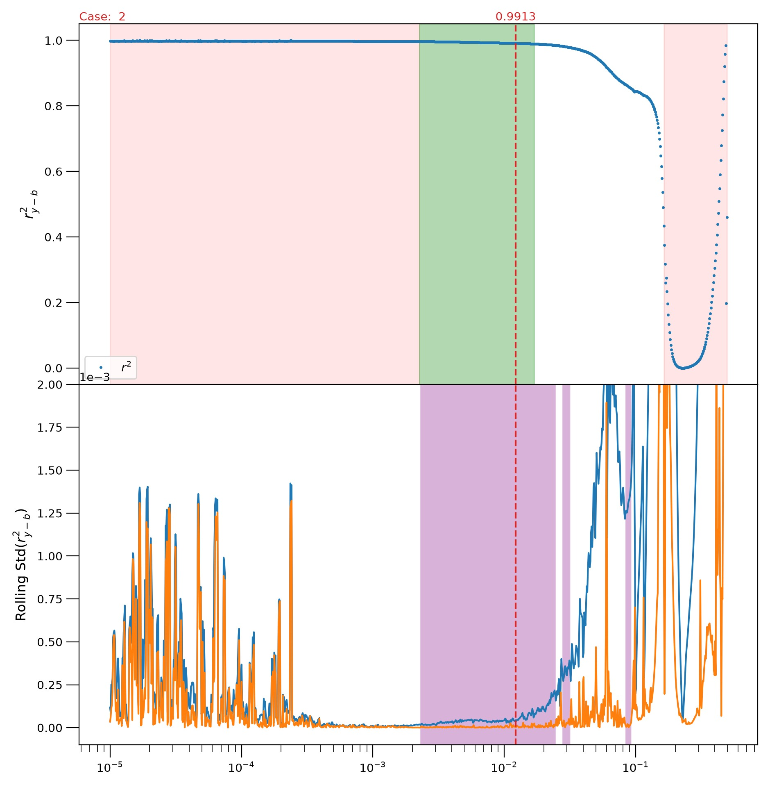

# Finding `fcut`: what was tried before

A chromatogram is the signal recorded by a detector at the outlet of a chromatographic column: it shows the concentration in the exiting mobile phase as a function of time. Within the column, each eluite moves as a band that spreads while it travels; when that band reaches the outlet and appears in the recording, it forms a peak. The peak’s retention time identifies which compound produced it, and its area or height, scaled by the compound’s detector response, indicates how much of that compound is present. In the ideal case, peaks are Gaussian; in practice, they often exhibit some tailing.

However, the peaks do not make up the entire signal. Beneath them, the trace drifts for multiple reasons such as the column bleeds, the solvent composition may change during a gradient elution, and the detector output shifts as it warms up. This slow drift constitutes the baseline, which lies under every peak and contributes extra area that is not associated with any eluite. Until this baseline is removed, the quantitative interpretation of the data is systematically off.

BEADS \[[5](#ning)\] is one approach to removing the baseline. It assumes that peaks are sparse (relatively few, narrow features on an otherwise long record), that the baseline is slowly varying and smooth, and that what is left over is white noise, so that, following Navarro-Huerta et al. \[[1](#nh)\], a chromatogram decomposes into three contributions at once, `y = c + b + e`: the sparse chromatogram, the baseline, and the noise. The decomposition is made on frequency, and the cutoff `fcut` is what sets the boundary between the baseline and the other two, so the whole separation turns on it. If `fcut` is too low, the baseline is too rigid: it cannot track the true drift, leaving some of that drift mixed into the peaks. If `fcut` is too high, the baseline becomes so flexible that it follows the peaks themselves and subtracts some of their area. The appropriate `fcut` lies between these extremes and varies from one chromatogram to another, as it depends on both the peak widths and the rate at which the baseline changes.

Manually choosing `fcut` is feasible, but automating that choice is much more troublesome (see issue [#4](https://github.com/physicien/Weaselytics/issues/4)). In both situations, though, the central tool is the autocorrelation plot: you fit a baseline at a wide range of cutoff values and, for each one, measure how much correlated structure remains in the baseline-corrected signal. Plotting this measure as a function of `fcut` produces a curve characterized by flat regions, or plateaus, separated by sharp drops.

This project extends the approach of Navarro-Huerta et al. \[[1](#nh)\], who originally proposed it for choosing the BEADS cutoff. They define two diagnostics: one applied to the noise `e`, whose minimum indicates the optimum, and another based on the baseline-corrected signal `y - b`, which produces the step-like profile used here. The log transformation is introduced separately, to solve a different problem. When a chromatogram contains peaks spanning a wide intensity range, BEADS tends to produce a baseline that oscillates beneath the tallest peaks, with ripple amplitude increasing with peak height. Truncating the tallest peaks works reasonably for simple chromatograms but fails in more complex cases with broad, structured baselines, where the ripples persist. To address this, Navarro-Huerta et al. suggested compressing the dynamic range via `z = log₁₀(y − min(y) + ε)` with `ε = 1` for signals whose maxima lie between 500 and 10,000. A larger offset results in milder compression; they also note that `ε = 1` sends the minimum of the record to zero. Under this transformation, the ripples beneath the peaks are eliminated, and the results are then mapped back using `b_corr,y = 10^(b_z) + min(y) − ε`.

The second diagnostic arises from this design choice. Once BEADS is applied to the log-transformed signal, the authors note that the returned noise `e` can no longer serve to estimate the autocorrelation, as an unbiased estimate of the noise on the original scale cannot be recovered. Instead, the baseline-corrected signal `y - b` is tracked. They explicitly describe this as a pragmatic compromise rather than a true equivalent: since `y − b` still contains the sparse chromatographic peaks, it does not constitute a proper residual for testing, and they defend the diagnostic on the grounds of usefulness rather than formal correctness. The statistic itself is built in three moves. The Durbin-Watson statistic weighs the point-to-point differences of a series against the size of the series itself, `DW = Σ(dᵢ − dᵢ₋₁)² / Σdᵢ²`, so it falls towards 0 for a smooth series and sits near 2 for white noise, where the expected squared step between neighbours is twice the variance. Expanding the numerator shows that `DW ≈ 2 − 2r`, with `r` the lag-1 autocorrelation of `d`, which is what makes the statistic a measure of correlation and not merely of roughness. Rearranging gives the quantity plotted in this project, `r² = ((2 − DW)/2)²`, which the authors found more convenient in practice and which is exact, rather than approximate, whenever the first and last points of the record match. As for choosing `fcut`, they place it roughly at the center of the final step and, in practical terms, recommend a value between the onset and the midpoint of that plateau, biasing the choice toward a slightly stiffer baseline. This rule of thumb reflects empirical behaviour across many chromatograms, not a theoretically derived optimum.

The idea of tuning a smoothing or baseline parameter using residual autocorrelation predates that particular paper and appears in other contexts, supporting the view that it is a sensible quantity to track. Vivó-Truyols and Schoenmakers \[[2](#vt)\] select the Savitzky-Golay window length by matching the lag-1 autocorrelation of the residuals to a noise estimate obtained from a blank run, a procedure published eleven years earlier in a different methodological context. Lytle and Julian \[[3](#lytle)\] present an iterative Durbin-Watson routine as one of two automatic approaches for choosing a smoothing filter. Bosten et al. \[[4](#bosten)\] adjust BEADS’ regularization parameters using a trimmed autocorrelation function, explicitly linking their method to the Savitzky-Golay lineage rather than to Navarro-Huerta, suggesting that the two strands of work converged on the same idea independently.

Still, this strategy is far from being standard practice. Neither Niezen et al. \[[6](#niezen)\], which is the largest recent benchmark of chromatographic background-correction methods, nor Milani et al. \[[7](#milani)\] employ autocorrelation in any way for parameter tuning.

In fact, the original BEADS paper \[[5](#ning)\] does not advocate an automatic selection rule at all. In their own evaluation, the cutoff is chosen manually, and the regularization weights are optimized against simulated data with known ground truth, something unavailable in real experiments. Consequently, the rule used here had to be devised from scratch rather than borrowed, and it has three stages: locate the plateaus, discard those that cannot contain the solution, and then pick a point from the remaining plateau.

This file documents the exploratory paths that were attempted for the first stage and then discarded. **None of these justify the current choice.** For the method actually implemented, see [segmentation.md](./segmentation.md).

> [!NOTE]
> **Peak width and `custom_bc`.** The log transformation of Navarro-Huerta et al. \[[1](#nh)\] settles only half of the scale problem. It handles peaks that differ in height by orders of magnitude, and leaves untouched the fact that they also differ in width: a single cutoff still has to serve the whole record, and peaks eluting late are broad. A broad peak is itself low-frequency, so a cutoff flexible enough to track the drift will follow that peak and take its area. Width needs the same kind of answer that amplitude got.
>
> `custom_bc` \[[10](#liland)\], in the pybaselines implementation \[[11](#pybaselines)\], provides that treatment. It discards points within each peak region in proportion to that region’s width, fits the baseline on this shortened series, and then stretches the result back to full length. Because a decimated region occupies fewer of the points actually seen by the algorithm, the same cutoff bends less there. Under isocratic conditions the plate number is approximately fixed, so band width increases with retention time and the late peaks are the broad ones. The decimation follows the same trend, increasing along the trace: `[2 4 5 10 11 18]` on `4-Xylene__LPYE__60-100__3`, one value per peak.
>
> Both fitting routes remain available, and on many chromatograms they reduce to the same calculation. The degree of decimation for a region is determined by that peak’s width relative to the narrowest peak in the trace, and it stays at a factor of one (no points removed) until a peak is about 1.18 times the minimum width. Thus, if all peaks in a trace have very similar widths, both routes generate a bit-for-bit identical baseline, regardless of other peak characteristics. The methods diverge only once the widths spread out, which is exactly what isocratic elution produces in any run spanning a broad retention-time range. `custom_beads` is the default, and is what every production run and reference sweep uses.

Two main strategies were evaluated, with multiple incremental variations in the case of the second one. Ultimately, both failed for the same underlying reason.

## Approach 1: threshold the derivatives

Take the first and second derivatives of the curve. On a genuinely flat region, both derivatives stay close to zero, so classify a point as part of a plateau when they both lie within a narrow band around zero. In practice, two bands were applied to the first derivative, a narrow (tight) one and a wider (loose) one, and a single band was applied to the second derivative.

*Rendered from commit `4883e7c`, on `2-Xylene__LPYE__CS2__15`. Top panel: the autocorrelation `r²` versus the cutoff frequency, with the smoothed curve from which the derivatives are computed. Middle: the first derivative of that autocorrelation, with its loose and tight tolerance bands. Bottom: the second derivative, with its own band. Points lying within all relevant bands are labeled as plateau.*

This behaves well on an idealized, smooth curve but breaks down on real data. Because the bands are defined in absolute units, their interpretation shifts with the record length, the spacing of the cutoff grid, and the noise level. A band tuned to one dataset is inappropriate for the next. Even worse, the overlap of the two bands can be empty, even when each individually covers most of the curve, simply because the two conditions are satisfied at different locations. When that happened, the algorithm had no stable reference and failed to return any plateau at all.

## Approach 2: threshold a rolling spread

Suggested by @derb12 in issue [#4](https://github.com/physicien/Weaselytics/issues/4). Instead of using derivatives, move a small window along the curve and quantify how much the values fluctuate within that window. On a plateau the spread is small; on a drop or in a noisy region it becomes large. Then distinguish “small” from “large” using a threshold determined automatically from the distribution of these scatter values, rather than specifying it manually.

*Commit `b6ddd57`, on `2-Dichlorobenzene__LPYE__C60__4`, a clean, well-behaved signal. Top panel: the autocorrelation `r²` as a function of cutoff frequency. Bottom panel: the rolling standard deviation of that same autocorrelation, with the bands identified as plateaus.*

This significantly improved performance and identified plateau boundaries accurately. The variations below are all attempts to make this approach more robust.

### Which spread to measure

The rolling standard deviation was used first. Then, the rolling median absolute deviation was tested as a more robust option, followed by a third measure: their difference. The reasoning was that if the two measures diverge, the window likely contains structure beyond simple noise.

*Commit `5415895`, on `4-Xylene__LPYE__60-100__3`. Top panel: autocorrelation `r²`. Bottom panel: two rolling statistics of `r²`, the standard deviation and `diff_std_mad`, defined as the standard deviation minus the median absolute deviation.*

Using the MAD on its own, however, removed the very feature that made the approach effective. Here, the scatter itself carries the signal, and a robust estimator smooths out exactly the excursions that identify the unstable regions.

### Where to put the threshold

The idea of an automatic threshold originates in image processing, where one faces a similar challenge: separating the key structures in an image from the background. In this context, both the triangle and Yen methods were evaluated. Each of these methods assumes that the values follow a unimodal distribution, enabling the algorithm to set a threshold somewhere between the dominant peak and its trailing edge.

In real data, this assumption breaks down often. In the dataset used for development, the scatter values separated into two or more distinct peaks in well over one-third of the signals. When this occurs, the automatic threshold is placed in an inappropriate region and entire plateaus are missed.

To mitigate this, the first step was to verify whether the single-peak assumption holds, using Hartigan’s dip test \[[8](#hartigan)\]. If the test suggests that the values do not constitute a single mound, the procedure switches to a *local* threshold instead. Here, “local” indicates that the threshold changes along the curve, rather than remaining a single, global value applied to the entire record.

*Commit `b6ddd57`, on `2-Chlorotoluene__LPYE__60-100__1`, whose rolling spread is highly multi-lumped, so the local-threshold branch is what produced these bands. Top panel: the autocorrelation `r²`. Bottom: its rolling standard deviation.*

It is important to note that the dip test and the local threshold were introduced in the same commit as the global threshold, rather than added afterward. The global rule was never deployed on its own.

However, this fix introduced a new issue. The dip test requires a p-value cutoff to decide when to label a distribution as “not unimodal,” and the chosen threshold was tuned to this specific dataset, rather than being grounded in a principled derivation.

### Skipping thresholding entirely

This was the most intriguing of the dead ends. Here, the rolling spread is compared directly to its own local threshold: wherever the two curves run in parallel without intersecting, that segment is treated as stable. Plateaus, then, emerge from the points where the sign of their difference flips, and at no step is an explicit threshold chosen.

*Commit `75f21df`, on `3-Chlorotoluene__LPYE__MINOR_isomer_C90__1`. Top panel: the autocorrelation `r²`. Bottom: its rolling standard deviation versus the local threshold; the crossings between them are what the method detects.*

In this sense it is threshold-free, which directly addressed the core difficulty of the rest of the approach, and it does not depend on how large the instabilities are. It was abandoned, however, because on some signals it completely skipped the region containing the correct cutoff, and a method that sometimes throws away the actual answer cannot be used, however tidy its logic may look.

### Stitching the fragments

Since earlier stages had broken plateaus into segments, later stages were meant to reassemble them: discard any run shorter than some chosen minimum length, fuse neighbouring stretches, then trim their edges. Each step came with its own manually tuned parameter.

## Where the second approach ended: the merger

The final version before the rewrite combined both strategies, since each behaved well exactly where the other failed. Derivative-based criteria reliably found the two plateaus at the extremes of the curve and pinned them down accurately; the rolling spread was used for the central region.

*Commit `f9316c3`, on `4-Xylene__LPYE__60-100__3`, which the method shatters into many fragments. Top panel: the autocorrelation `r²`. Bottom: its rolling standard deviation and `diff_std_mad`.*

The author’s own comment in issue [#4](https://github.com/physicien/Weaselytics/issues/4) still gives the clearest assessment: the interaction of the criteria was opaque, several thresholds were chosen ad hoc without real justification, and the resulting plateaus were so over-fragmented that they were impractical to use, with no clear way to repair this without also accepting clearly incorrect regions.

## The single underlying failure

All of the approaches discussed above follow the same basic pattern: compute a scalar value at every point on the curve, compare that value to a threshold, and then assign labels to points individually and independently.

In practice, though, plateaus are not perfectly level. The plateau associated with the “correct” cutoff usually has a gentle downward slope extending over more than an order of magnitude in `fcut`. With enough drift, any fixed threshold will eventually be crossed, so what is physically a single continuous plateau ends up being chopped into multiple short segments separated by gaps. Each of the repair heuristics described earlier is, in effect, a way of piecing back together something that should not have been split in the first place.

The method currently in use (see [segmentation.md](./segmentation.md)) is built on this observation: rather than labeling individual points, partition the curve into contiguous segments, so that a drifting plateau is, by definition, represented as one continuous interval. This is essentially the same idea that underlies the L-curve literature \[[9](#hansen)\] cited by @derb12 in issue [#4](https://github.com/physicien/Weaselytics/issues/4), where choosing a regularization parameter amounts to locating the corner of a similarly shaped curve; the present implementation is derived from that idea.

## Removed elsewhere in the chain

Everything above deals with the first stage, finding the plateaus. The following three points were removed from later parts of the chain: one from the cutoff-selection stage, and two from the measurement that feeds all three stages.

- **Anchoring at the right edge**, in the selection stage. The cutoff used to be placed at the right-hand edge of the selected plateau, just before the drop. When tested against synthetic baselines with known ground truth, the optimal cutoff actually falls well inside the plateau, as the error valley is shallow on the stiff side and steep on the flexible side. This was removed in `64233cd`.
- **Correlating the wrong channel**, in the measurement. The autocorrelation was previously computed on `c`, the sparse chromatogram BEADS returns, instead of on the corrected signal `y - b`. Since the statistic aggregates squared differences between adjacent points, any residual noise over a short segment dominated it whenever peaks were small, so the weaker the signal the worse it behaved. This was changed in `41a7580`.
- **The coarse detrend**, in the preprocessing. A rolling median over one quarter of the record had been subtracted before peak finding, which tied peak detection to the arbitrary placement of the baseline. Introduced in `6a1a380`, this was reverted in `b4ada64` in favour of rejecting any detected peak that contains a taller one.

## References

1. Navarro-Huerta, J.A., et al. Assisted baseline subtraction in complex chromatograms using the BEADS algorithm. Journal of Chromatography A, 2017, 1507, 1-10. https://doi.org/10.1016/j.chroma.2017.05.057

2. Vivó-Truyols, G.; Schoenmakers, P.J. Automatic selection of optimal Savitzky-Golay smoothing. Analytical Chemistry, 2006, 78(13), 4598-4608. https://doi.org/10.1021/ac0600196

3. Lytle, F.E.; Julian, R.K. Automatic processing of chromatograms in a high-throughput environment. Clinical Chemistry, 2016, 62(1), 144-153. https://doi.org/10.1373/clinchem.2015.238816

4. Bosten, E.; Van Broeck, B.; Cabooter, D. Automated tuning of denoising algorithms for noise removal in chromatograms. Journal of Chromatography A, 2023, 1709, 464360. https://doi.org/10.1016/j.chroma.2023.464360

5. Ning, X.; Selesnick, I.W.; Duval, L. Chromatogram baseline estimation and denoising using sparsity (BEADS). Chemometrics and Intelligent Laboratory Systems, 2014, 139, 156-167. https://doi.org/10.1016/j.chemolab.2014.09.014

6. Niezen, L.E.; Schoenmakers, P.J.; Pirok, B.W.J. Critical comparison of background correction algorithms used in chromatography. Analytica Chimica Acta, 2022, 1201, 339605. https://doi.org/10.1016/j.aca.2022.339605

7. Milani, N.B.L.; García-Cicourel, A.R.; Blomberg, J.; Edam, R.; Samanipour, S.; Bos, T.S.; Pirok, B.W.J. Generating realistic data through modeling and parametric probability for the numerical evaluation of data processing algorithms in two-dimensional chromatography. Analytica Chimica Acta, 2024, 1312, 342724. https://doi.org/10.1016/j.aca.2024.342724

8. Hartigan, J.A.; Hartigan, P.M. The dip test of unimodality. The Annals of Statistics, 1985, 13(1), 70-84. https://doi.org/10.1214/aos/1176346577

9. Hansen, P.C.; O'Leary, D.P. The use of the L-curve in the regularization of discrete ill-posed problems. SIAM Journal on Scientific Computing, 1993, 14(6), 1487-1503. https://doi.org/10.1137/0914086

10. Liland, K.H.; Rukke, E.-O.; Olsen, E.F.; Isaksson, T. Customized baseline correction. Chemometrics and Intelligent Laboratory Systems, 2011, 109(1), 51-56, §3. https://doi.org/10.1016/j.chemolab.2011.07.005

11. Erb, D. pybaselines: A Python library of algorithms for the baseline correction of experimental data. https://doi.org/10.5281/zenodo.5608581
