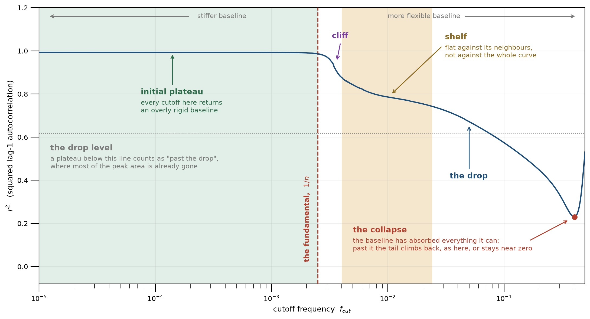
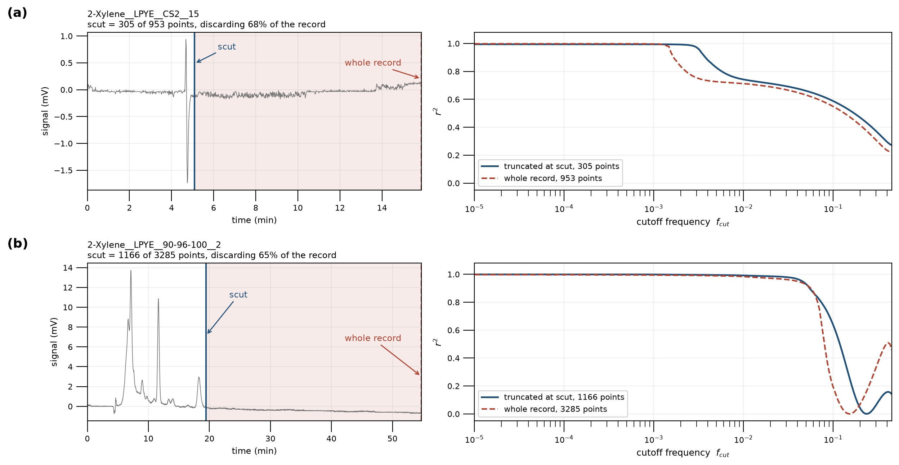
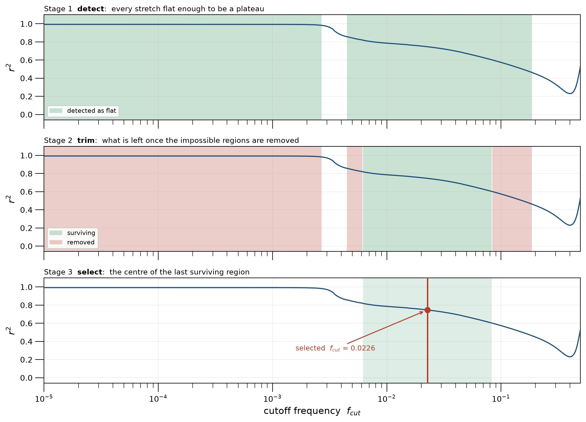
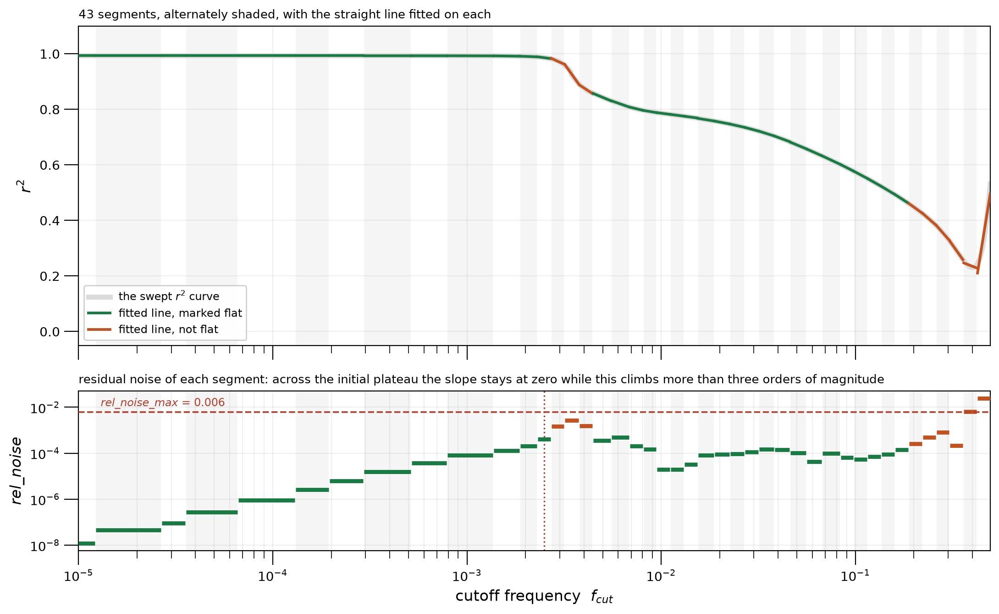
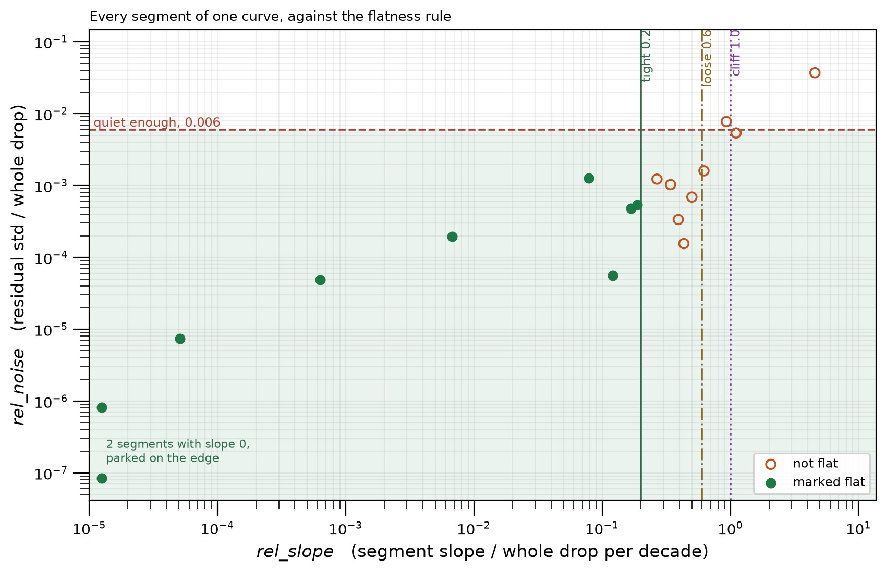
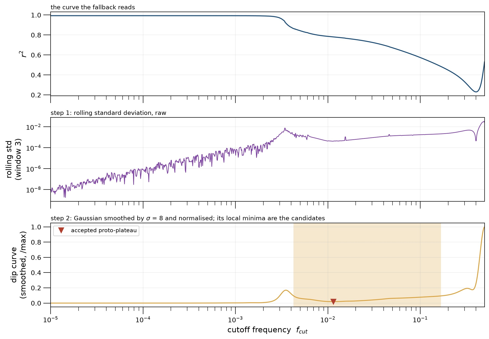
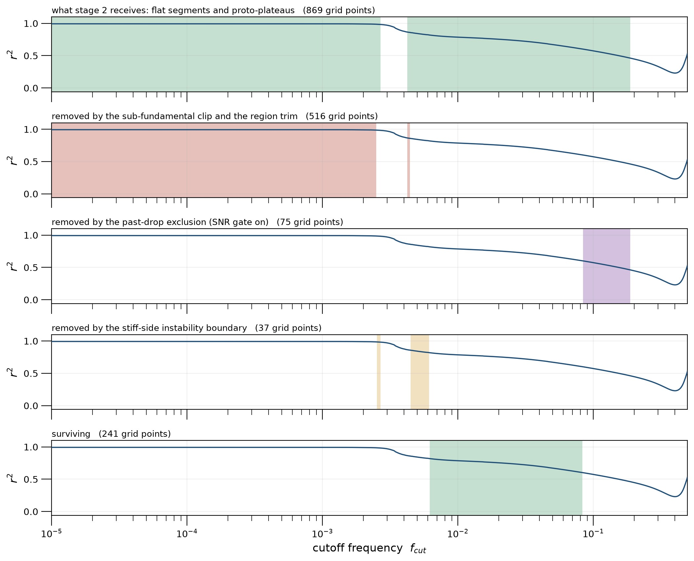
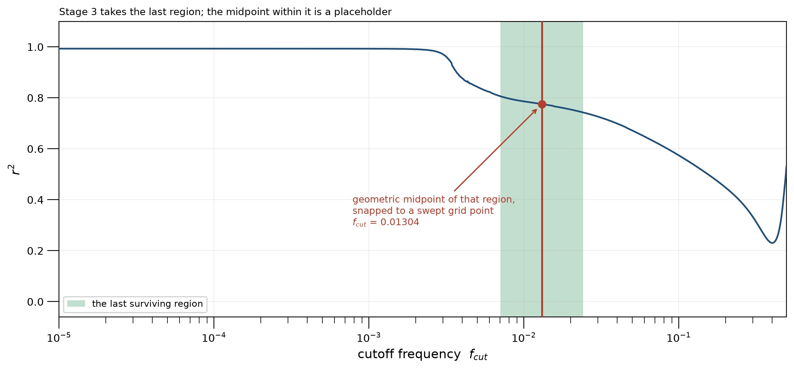
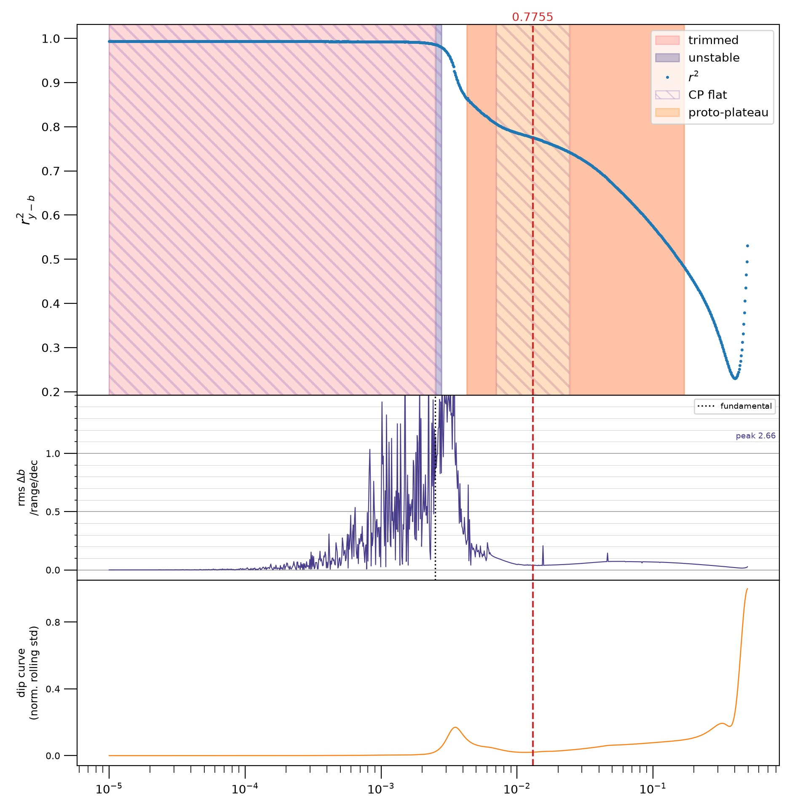

# How `fcut` is chosen

The Baseline Estimation And Denoising with Sparsity (BEADS) algorithm \[[9](#ning)\] is a robust method for baseline correction and noise reduction. It separates the baseline from the analytical signal in the frequency domain, and the main challenge in its application is choosing an appropriate cutoff frequency between the two, since the resulting baseline is highly sensitive to this parameter. In addition, the optimal cutoff may vary from one chromatogram to another. This document describes how that cutoff frequency is determined by Weaselytics in an unsupervised manner, using the autocorrelation-based strategy introduced by Navarro-Huerta et al. \[[1](#nh)\].

In line with Navarro-Huerta et al. \[[1](#nh)\], BEADS represents a signal `y` (in this context, a chromatogram) as the sum of three terms, `y = c + b + e`: the sparse signal `c`, the baseline `b`, and the noise `e`. The cutoff frequency `fcut` specifies the boundary between `b` and the joint contribution of `c` and `e`.

Since the true baseline in an experiment is never directly observable, `fcut` cannot be optimized by simply sweeping over values and picking the one that minimizes an error against known ground truth. Instead, Navarro-Huerta et al. vary `fcut` across a range and, for each candidate value, compute the autocorrelation coefficient `r²` of the residual `y - b`. When `r²` is plotted against `fcut`, the curve displays broad, nearly flat regions where the fit changes little with `fcut`, separated by intervals where `r²` decreases; the flat regions are referred to as plateaus, the decreasing regions as drops. The most suitable `fcut` is selected from a plateau, typically from the last plateau before `r²` drops toward zero or reaches its minimum.

Identifying this by eye on a single chromatogram is straightforward. Performing the same task unsupervised for every chromatogram in a run is harder on two counts:

* **Plateaus must be algorithmically defined.** What looks like a plateau to a person is cumbersome to formalize, because it is never perfectly flat: the relevant plateau usually slopes downward over more than an order of magnitude in `fcut`.
* **Not all plateaus are admissible solutions.** Each decrease in `r²` signals that correlated structure has been removed from the signal, but does not distinguish whether that structure corresponds to baseline drift, noise or peaks; the curve therefore narrows down the plausible range without uniquely indicating the correct point.

The procedure adopted here proceeds in three phases: identify flat segments, eliminate those that cannot contain the solution, and then, select a point from the remaining candidates. It is implemented in `weaselytics/segmentation.py` and `baseline._fcutoff`. Methods previously explored for the first phase and subsequently discarded are documented in [fcut_history.md](./fcut_history.md).

## What the curve quantifies

The parameter used for the sweep is the squared lag-1 autocorrelation, `r² = ((2 - DW)/2)²`, where `DW` is the Durbin-Watson statistic of the residuals \[[12](#dw)\], applied to this problem by Navarro-Huerta et al. \[[1](#nh)\]. `DW` compares the point-to-point differences of a series with the series’ overall magnitude, and thus reflects how stable the variation is from one point to the next over a three-point window. A series that changes only slowly relative to the sampling interval has small successive differences, pushing `DW` towards 0 and yielding `r²` close to 1; in contrast, white noise, whose expected squared increment between adjacent points is twice its variance, lies near `DW = 2`, producing `r²` near 0. This statistic is computed at each cutoff along a geometric progression, using the baseline-corrected signal in place of the noise term `e`. In the notation used here, this is `z - b_z`: the log-transformed signal minus the baseline BEADS fitted to it, so the residual is monitored on the logarithmic scale, as in Navarro-Huerta et al. The resulting dependence of this coefficient on the cutoff defines what we call the autocorrelation plot.

On the frequency cutoff autocorrelation plot, `r²` systematically follows the same pattern:

* **At low cutoffs it is close to 1.** The baseline that is removed is either overly rigid or nearly flat, so almost nothing correlated has been subtracted and the residual remains essentially the full chromatogram, drift and peaks together.
* **In the intermediate range it decreases in steps.** The baseline captures the correlated part of the signal one contribution at a time, broad-scale structures first. The plateaus are informative: each flat segment corresponds to an interval of `fcut` for which BEADS yields a stable baseline, making these regions the key parts of the plot to interpret.
* **At high cutoffs it reaches its minimum.** The eluite peaks are then increasingly attenuated as well, until the residual approaches white noise and `r²` converges toward 0.

Nonetheless, `r²` by itself cannot indicate whether the structure removed at any given cutoff originates predominantly from the baseline or from the peaks, since absorbing either kind of structure lowers the autocorrelation. For a chromatogram where a strong analyte signal dominates, going beyond the main drop in `r²` starts to erode peak area and must be avoided. In contrast, when analyte signals are weak and the baseline is the principal structured component, eliminating that structure is the objective. In such cases, a stable plateau beyond the initial drop may correspond to an appropriate baseline. Thus, the relative contribution of analyte-related versus baseline-related structure is an important factor distinguishing these cases, information that the autocorrelation metric alone does not provide.

The sweep is performed on the log-transformed signal via `_log_transform`, which implements the transformation proposed by Navarro-Huerta et al. \[[1](#nh)\], `z = log₁₀(y − min(y) + ε)`. The transform serves only to select the cutoff: no baseline is mapped back, and the selected cutoff is then applied to a BEADS fit on the raw signal `y`. The inverse Navarro-Huerta et al. use is `b_corr,y = 10^(b_z) + min(y) − ε`. The offset `ε` keeps the logarithm’s argument positive and also controls the strength of the compression: larger values of `ε` yield milder preprocessing. This transformation serves two purposes:

* **It compresses the dynamic range.** This was the motivation of Navarro-Huerta et al.: when peak heights span several orders of magnitude, BEADS produces a baseline that ripples beneath the tallest peaks, with the ripples amplitude increasing with the peak height. Simply clipping the tallest peaks corrects only simple chromatograms and leaves such ripples in complex ones, so they instead compressed the intensity scale, which eliminated the ripples.
* **It defines the scale on which regularization operates.** The parameters `lam_0`, `lam_1`, and `lam_2` penalize the signal, its first derivative, and its second derivative, respectively; larger values impose stronger penalization and thus yield a sparser `c`. All three are delegated to pybaselines \[[8](#pybaselines)\], which, following Ning et al. \[[9](#ning)\], sets `lam_d = alpha / ||z^(d)||_1`. This choice makes the penalty terms invariant to the overall scale, whereas the data-fidelity term is not, so signals with different magnitudes do not each require a separate `alpha`.

## Interpreting the curve

Every portion of the curve referenced explicitly in this document is shown in Figure 1.

*Figure 1. A single autocorrelation curve, `Chlorobenzene__LPYE__60-70__2`, annotated to mark each feature used by the method.*

As illustrated in Figure 1, the cutoff parameter governs a continuous range of baseline behaviors, from stiff on the left to flexible on the right. When the cutoff is small, only the slowest, longest-period oscillations are retained, resulting in an excessively stiff baseline, analogous to a beam buckling under compression. As the cutoff grows, the baseline is allowed to bend more, and increasingly higher curvature is admitted.

The **initial plateau** occupies most of this stiff regime. Because a signal of length `n` samples cannot represent oscillations with a period longer than the full signal, any cutoff below `1/n` enforces an unrealistically stiff baseline and therefore leads to a parabolic fit that often swings erratically between nearby values of `fcut`. The limiting frequency at which this behavior ceases is the **fundamental frequency**, and the initial plateau ends at this point. Here, `n` denotes the number of samples actually included in the sweep, written as `n_used` in the code and determined by the truncation procedure described below.

<b>How reliable is the curve below the fundamental?</b>

> When the same signal is swept twice with identical code and a fixed pybaselines version, but different numpy and scipy versions, the resulting curves match very closely at high cutoffs yet diverge at low cutoffs. Each library affects a different stage:
>
> * **numpy determines the sweep grid.** `np.geomspace` generates the cutoff values, and its output can differ slightly between numpy versions, so the two sweeps end up evaluating BEADS at cutoffs that differ in their lowest significant bits.
> * **scipy performs the numerical solve.** BEADS relies on banded linear solvers, so changes in these routines can perturb the result by more than what would be expected from simply propagating a single-last-bit change in the cutoff.
>
> The pattern of disagreement resembles a conditioning issue: the curves coincide down to the last bit at high cutoffs and then gradually diverge as the cutoff decreases. The method effectively magnifies a one-ulp perturbation in the input into a visible discrepancy. Navarro-Huerta et al. \[[1](#nh)\] describe this as one of the shortcomings of BEADS that they seek to remedy: at low frequencies, the estimated baseline is excessively sensitive to the cutoff, the optimization becomes unstable, and this instability is intensified by the very wide range of cutoffs that must be explored, often spanning several orders of magnitude for long signals.
>
> As a result, any plateau, step, or inflection observed in this low-cutoff region must exceed that reproducibility threshold before being regarded as a real feature of the data. The sub-fundamental clipping in stage 2 removes this region altogether, and the subsequent instability exclusion, which extends slightly above it, is the portion of the workflow that is most sensitive to library-version changes. That vulnerability persists even with version pinning, as each upgrade effectively resets it.

Beyond the fundamental frequency, the curve begins to decrease, typically not as a single smooth slope. In this descending region, the curve exhibits several characteristic features. A **cliff** is a sharply dropping segment; a **shelf** is a comparatively flat region between two cliffs; and a curve made up of several cliffs and shelves is referred to as a **staircase**. A shelf is flat only relative to its immediate neighbors: over the full vertical range of the curve, it still shows a noticeable gradient. Consequently, the shelves of a staircase and the plateaus in a two-step curve cannot be identified using one common flatness threshold. **The drop** refers to the portion of the descent that contributes the majority of the total vertical change, wherever it is located along the curve.

A plateau lying at cutoffs beyond the drop is said to be **past the drop**. Stage 2 finds those by level rather than by position: each segment is assigned a mean `r²`, the lowest and the highest of those means set the scale, and a flat segment is discarded when its own mean lies below a fraction `drop_level` of that interval. This exclusion was introduced to prevent selecting a cutoff past the drop, which would otherwise erode the peak area. Against known baselines the damage begins well before that boundary: peak area is already being absorbed along the descent, so by the drop level most of it is gone and the exclusion removes a region where the loss has already happened rather than preventing it. It is also gated on `_snr`, so that a signal whose structure is mostly baseline keeps its past-drop plateaus. In practice, this condition never triggers and requires further evaluation.

**The collapse** is defined as the global minimum of the curve. At this point, the baseline has already captured all accessible correlated structure; for cutoffs beyond the collapse, the tail either turns upward, as illustrated in Figure 1, or stays close to zero.

Two further terms are inherited from the implementation rather than from geometric features of the curve. The **flat set** is the union of all regions that stage 1 classifies as plateaus, and a **surviving region** is any contiguous subset of the flat set that remains after stage 2 removes intervals that cannot contain the desired solution.

## Core principle of the new method: changepoint segmentation of the curve

In real or synthetic data, a plateau is never perfectly flat. The plateau that contains the optimal cutoff frequency usually tilts slightly downward over more than one decade in `fcut`. With a sufficiently strong tilt, any fixed pointwise threshold will eventually be crossed, so what is in truth one continuous plateau is split into multiple separate pieces with gaps between them. This is exactly how all earlier methods in [fcut_history.md](./fcut_history.md) failed: they fragmented a single plateau, and all their respective remedies (minimum-length rules, ad hoc merging, edge trimming) were attempts to reconstruct an object that should not have been broken apart in the first place.

The current approach is organized around this observation. The curve is first divided into contiguous segments by **changepoint detection**, the boundaries between segments being the changepoints, and each segment is then classified as a whole. By design, a drifting plateau is fully contained within a single segment, eliminating any need for later stitching of fragments and hence any associated repair parameters. A conceptually similar strategy appears in the L-curve literature \[[10](#hansen)\], where choosing the regularization parameter likewise reduces to locating the corner of a curve with this characteristic geometry.

## Preparing the data

Two preprocessing operations are performed before the initial cutoff sweep, and the three subsequent stages assume both are already in place. The helper `_relevant_regions`, called at the beginning of `auto_beads`, performs both operations together. The function assumes the raw signal can be modelled as baseline plus noise plus a sparse collection of peaks of reasonable signal-to-noise. On that assumption it locates peaks in a lightly smoothed copy of the signal, then removes those too wide to plausibly represent analyte rather than baseline structure. For every remaining peak except the very narrowest, it defines a window extending to 0.85 of that peak’s FWHM on either side of the maximum, equivalent to `±2σ`, or 95% of the area of a Gaussian. Any overlapping windows are subsequently merged. The function returns `scut`, the index just after the last detected peak, together with the resulting bracketed regions and associated decimation factors.

The first output decides how much of the signal is swept, the second decides how freely the baseline may bend within it, and each reappears later in the chain: `scut` fixes `n_used` and therefore the fundamental that stage 2 clips below, while the regions move the collapse that stage 3 anchors against.

<b>Preliminary identification of peaks in the raw signal</b>

> Within `_relevant_regions`, peaks are detected on a lightly smoothed copy of the signal using `peaks_params(..., drop_enclosing=True)`. The `drop_enclosing` flag rejects any peak that fully encloses a taller one, based on the chromatographic assumption that a genuine peak may contain a smaller shoulder within its own half-width but can never contain a taller peak. Consequently, any such enclosing feature is interpreted as baseline structure rather than a true chromatographic peak.
>
> The prominence a feature needs to count as a peak is not fixed. `peaks_params` is called with `adapt=True`, which makes it set that threshold from the signal it is given: the required prominence is a fraction of the largest prominence present, and the fraction itself is raised on signals whose tallest feature is small. A signal whose largest prominence is at most 1 requires half of it, at most 2.5 requires 0.08 of it, at most 10 requires five times the value passed in, and only above 10 does the passed value apply unchanged. The effect is that a weak signal is judged against its own strongest feature rather than against an absolute bar, so the detector does not read the noise of a blank as a chromatogram. Its rungs and the two breakpoints are constants like any other, and the audit has not examined them.
>
> The smoothing is a Gaussian of standard deviation `smooth_sigma`, three points by default, and it is what draws the line between a peak and the noise floor. Without it the detector answers on the noise: at a width small enough only to suppress single-sample spikes, the noise floor itself clears the relevance filter, and the last feature `scut` admits becomes a noise bump rather than an eluting peak. Since `scut` fixes `n_used` and therefore the fundamental, a detection that mistakes noise for a peak reaches all the way into the stage 2 clip. What the smoothing costs is paid on the peaks it keeps: the apex is attenuated, and a peak of full width `w` is measured at `sqrt(w² + (2.355 · smooth_sigma)²)`, so a five-point peak comes out 73% wider at the default. Those widths are what the relevance filter and the decimation factors are computed from.

### Truncating the signal at `scut`

The sweep is not carried out over the full signal. Consider a chromatogram where the analyte elutes in the first tenth of the run and the rest of the signal is flat: this terminal plateau contributes only noise to the statistic and, if included, dilutes the informative portion. The autocorrelation then becomes harder to interpret, more computationally expensive, and its targeted features are shifted. Consequently, the signal is truncated. Currently, truncation is applied only to the right-hand side, but extension to the left-hand side should also be considered following further investigation.

*Figure 2. The same signal processed twice, once with the signal truncated and once with the full signal. Left: the raw signal with the cutoff marked and the discarded portion shaded. Right: the corresponding autocorrelation curves. (a) a weak signal containing a single narrow peak, (b) a run with multiple peaks.*

### Shaping the fit with the regions

The 0.85 factor is dictated by the peak profile. A region must encompass the peak it is assigned to, and for a Gaussian peak, roughly 95% of the area lies within `±2σ` of the maximum, so the region should extend over a total width of `4σ`. Since the full width at half maximum (FWHM) of a Gaussian is `2.355σ`, this `4σ` corresponds to `1.70` FWHM, and half of that, `0.85` FWHM, falls on each side.

In the pybaselines implementation \[[8](#pybaselines)\], these regions and their associated decimation factors are passed to `custom_bc` \[[7](#liland)\]. Peaks at longer retention times become broader, and a very broad peak behaves like a low-frequency component. Beyond a certain point, a single global cutoff can no longer adequately describe the entire chromatogram, as cutoff that is flexible enough to capture baseline drift will also tend to track these broad peaks and subtract part of their area. `custom_bc` mitigates this by discarding data points within each region in proportion to that peak’s width, fitting the baseline to the resulting decimated series, and then interpolating back to the original resolution. A region that is more heavily decimated contributes fewer points to the baseline fit, so the same nominal cutoff will bend less within that section. Under isocratic conditions the plate number is approximately constant, so band width grows with retention time, and the decimation factor correspondingly increases along the chromatogram.

In `auto_beads`, `custom_beads`, which passes `beads` through `custom_bc`, is the default and is used for all production analyses. Although one might expect that the selection procedure would always be mirrored in differences between the two fitting schemes, they generally coincide across the plateau segments and diverge only near the collapse. At that point, `custom_beads` shifts the collapse to a higher cutoff because the stiffer baseline beneath the peaks delays the onset of peak erosion. Since the selection is tied to the final plateau before the collapse, this shift is the only step where the chosen fitting strategy alters the final outcome.

Nonetheless, the two methods coincide in their numerical behavior more often than this description might suggest. The decimation factor is defined as `ceil(0.85 × this peak's width / the narrowest peak's width)`, which stays at 1 (no points removed) until a peak is about 1.18 times wider than the narrowest one. For a chromatogram in which all peaks have almost the same width, both strategies yield an exactly identical baseline; discrepancies emerge only as the variability in peak widths increases.

## The three stages

Once the signal has been prepared and the scan across the curve completed, selection unfolds as a pipeline of three stages, each successively shrinking the candidate set it passes on. The first stage inspects the entire curve and outputs every interval whose flatness is sufficient to count as a plateau. The second stage eliminates those surviving regions that provably cannot contain the solution, using criteria derived independently of the curve itself. The third stage then chooses a single cutoff from what remains. Figure 3 illustrates all three stages applied to the curve shown in Figure 1.

*Figure 3. The three-stage chain on the curve from Figure 1. Top: all segments that stage 1 labels as flat. Middle: the subset that remains after stage 2 exclusions. Bottom: the final point selected by stage 3.*

### Stage 1: detect

Stage 1 reads the whole curve and returns every stretch flat enough to be a plateau. It gets there in three steps: cut the curve into segments, describe each segment in units that do not depend on the sweep, then decide which of them count as flat. A fourth path, the fallback channel, runs alongside for the curves that have no flat segment at all.

#### Step 1.1: cut the curve into segments

The curve is first cut into consecutive linear segments, each with its own slope and noise level. The boundaries are its **changepoints**, and locating them is a changepoint-detection problem: among all possible partitions, the chosen one minimises the total of the individual segment costs plus a fixed penalty charged for every changepoint added. This is implemented in `pelt_linear`.

The minimum is found exactly, over every possible partition, not by splitting greedily. `pelt_linear` uses the optimal-partitioning recursion of Jackson et al. \[[2](#jackson)\]: the best partition of the curve up to point `j` is the best partition up to some earlier point `i`, plus the cost of the single segment from `i` to `j`, plus the penalty for having added a segment. Sweeping `j` from left to right and taking the cheapest `i` at each step builds the optimum in `O(N²)` from cumulative sums, and reading the chosen `i` values backwards from the end recovers the boundaries. The PELT pruning of Killick et al. \[[5](#killick)\] would cut this to an expected `O(N)`, and the `ruptures` package \[[6](#truong)\] provides equivalent algorithms, but a pure-NumPy implementation avoids the dependency and is fast enough at the typical `N = 1000`.

The cost of one segment is the Gaussian log-likelihood `m log(SSE/m)`, where `SSE` is the sum of squared residuals about the least-squares line through the segment and `m` its length. Fitting a line means a change of slope creates a boundary; fitting the variance separately on each segment means a change of noise level creates one too, **even where the mean does not move at all**. That second half is what lets a quiet plateau be separated from a stretch of BEADS instabilities sitting at the same height. The per-segment penalty follows Killick et al. \[[5](#killick)\] §2 in the tradition of Schwarz \[[4](#schwarz)\]: `beta = p log n`, with `p` the number of parameters a changepoint adds. Fitting a slope, an intercept and the segment's own variance makes `p = 3`, so the default is `3 ln N`. Yao \[[3](#yao)\] treats the piecewise-constant case with a variance common to every segment and gives factor 1.

*Figure 4. Top: the segments of the curve from Figure 1, alternately shaded, with the straight line fitted on each. Bottom: the residual noise of each segment. Across the initial plateau the fitted slope stays at zero while the residual noise climbs by more than three orders of magnitude, and that is what puts the boundaries there.*

#### Step 1.2: describe each segment

Once the curve has been segmented, each segment must be encoded in a way that is invariant under changes of the sweep. The function `segment_features` assigns to each segment its mean, a fitted slope, and its residual noise, and then rescales the latter two with respect to the overall geometry of the curve.

The slope scale is the total drop of the curve divided by the number of grid points in one decade of cutoff, so `rel_slope = |slope| / (drop / points_per_decade)` is the segment's slope expressed in units of "the whole drop spread over one decade". A segment with `rel_slope = 1` descends as steeply as the entire curve would if its whole fall were compressed into a single decade. The noise scale is simply the drop, so `rel_noise = resid_std / drop` is the residual scatter as a fraction of the total fall. Both quantities are therefore independent of grid spacing, signal length, and the physical units of the statistic.

#### Step 1.3: decide which segments are flat

A segment is ultimately labeled as flat only if it is both sufficiently low-noise and sufficiently horizontal. The function `classify_segments` imposes the constraint `rel_noise < 0.006` together with one of two slope conditions: a *tight* requirement, `rel_slope < 0.2`, or a *loose* requirement, `rel_slope < 0.6`, the latter applying only when there is at least one cliff (`rel_slope > 1.0`) on each side.

Drawn as a region of the plane, the rule is a box: everything quieter than `rel_noise_max` and flatter than the tight threshold is admitted, with the loose tier reaching a little further to the right when cliffs bracket the segment.

*Figure 5. The segments of the same curve placed in (`rel_slope`, `rel_noise`), with the three slope thresholds and the noise threshold drawn on top. Segments whose fitted slope is exactly zero cannot be placed on a logarithmic axis and are parked on the left edge.*

The loose criterion is motivated by the staircase structure in Figure 1, where the total drop is partitioned across several cliffs, causing each intermediate shelf to tilt at a substantial fraction of the global slope scale and rendering any strictly tight cutoff overly conservative. This secondary tier can only expand the set of segments deemed flat, never reduce it. Assessing whether it is actually useful, and whether it is triggered by the morphologies it is designed to capture, requires empirical testing and lies beyond what the rule itself can determine.

#### The fallback channel

A second detection pathway operates in parallel with the first, targeting curves that never exhibit a fully flat segment. Here, `dip_curve` denotes the rolling standard deviation of the autocorrelation, subsequently Gaussian-smoothed and normalised by its maximum, and `detect_dips` identifies its local minima. These minima flag relative flattenings that do not rise to the level of global flatness over the entire curve.

The construction runs in two steps. The rolling standard deviation over a three-point window turns the curve into a measure of local roughness: it is near zero along a plateau and large across a cliff. Gaussian smoothing then removes the point-to-point jitter of that measure, and dividing by its own maximum puts it on a fixed scale so that the prominence and level filters can be stated as fractions. `find_peaks` is then run on the *negative* of the result, so that its peaks are the valleys of the roughness, each one a stretch of curve quieter than its surroundings. A valley is kept when it is prominent enough against the largest cliff and when it sits inside a band of the total drop, and its extent is measured at half prominence.

*Figure 6. The curve, its raw rolling standard deviation, and the smoothed and normalised `dip_curve` that `detect_dips` actually reads. The marker sits at each accepted valley and the shaded span is the basin measured around it.*

They function purely as a fallback: `trim_plateaus` first subjects the flat-segment channel to the same exclusion logic on its own, and incorporates dips only when that process yields no candidates at all. If flat segments and dips were combined without condition, the dips would also be triggered on the post-collapse descent, where a local easing of the slope appears as a minimum but remains an order of magnitude steeper than any genuine plateau.

The thresholds in `detect_dips` were chosen by visual inspection rather than analytical derivation, and there is no external reference that specifies them. They originated as diagnostic parameters while the dips contributed only to visual overlays, but the fallback mechanism turns them into critical load-bearing settings for any signals on which that channel is activated.

### Stage 2: trim

A region cannot contain the solution when prior knowledge already rules it out, regardless of how flat it appears: it may replicate a satisfactory fit that is already present elsewhere, it may fall inside a zone where a cutoff would remove analyte peak area, or it may be located where the fit is not constrained by the data. `trim_plateaus` enforces one exclusion criterion for each of these cases. The core processing occurs in `_trim_masks`, which returns the final combined mask and an additional mask for each exclusion type, enabling the diagnostic plot to indicate which exclusion removed which points.

*Figure 7. What stage 2 receives and what each exclusion takes away, on the curve of Figure 1. The three exclusions are shown separately because they overlap: a grid point can be eligible for more than one, and `_trim_masks` attributes it to the first that claims it.*

The **sub-fundamental clip** is always applied. Every cutoff below the fundamental requests a baseline slower than the signal can represent, so the whole of the initial plateau returns an overly rigid one and contains no admissible candidate. Grid points below `c1 / n_used` are removed, with `c1 = 1.0`, the fundamental itself.

The **past-drop exclusion** is applied only when the caller asks for it. It was introduced to keep a cutoff past the drop from being chosen, on the grounds that it would erode most of the peak area, and it discards the flat segments whose mean sits below `drop_level` of the range spanned by the segment means. Two things about it are unsettled. Peak area is already being absorbed along the descent, so by the drop level most of it is gone and the exclusion removes a region where the loss has largely happened rather than preventing it, and against known baselines it sometimes removes the flat region holding the optimal cutoff. The gate meant to spare a signal whose structure is mostly baseline, `_snr(s) >= 10` after MacDougall et al. \[[11](#macdougall)\] Table I, has never switched on any signal this package has processed, so the exclusion is unconditional in practice and the case it defers to is untested.

The gate is a veto on the choice among survivors and never on selecting at all: if applying it would empty the surviving set, `_trim_masks` falls back on the set without it, since no cutoff whatsoever is a worse answer than a poor one. The threshold also only discriminates where the signals straddle it, and a population sitting entirely above it has the exclusion applied to everything, which means such a population cannot validate the threshold either.

The **stiff-side instability exclusion** applies when a sensitivity curve is supplied, and it reaches the part of the stiff end that the clip cannot. `_sensitivity_curve` records the rms change of the fitted baseline between adjacent cutoffs, relative to the signal range, per decade. This curve is the quasi-optimality functional of Bauer and Kindermann \[[13](#bauer)\]: their discrete criterion minimises the change between adjacent solutions, and their continuous form the change per unit log-parameter, which is what dividing by the grid's log spacing produces. It is used here to locate instability rather than to select, since taking its argmin was tested and lost to the midpoint. Where the fit is undetermined the baseline swings between neighbouring cutoffs, so `sensitivity_dispersion` takes the interquartile range within a sliding window of 0.2 decades, dispersion being what separates genuine flailing from a baseline that moves steadily but predictably, which is what happens as the collapse is approached. `instability_boundary` then asks whether the signal’s fundamental falls inside a flailing region and, if it does, returns the cutoff up to which the fit remains undetermined.

Its two thresholds, `trigger = 0.10` and `settled = 0.05`, are **not grounded, and are frozen pending further investigation**. They are amplitudes of a dimensionless curve, so they read as statements about tolerable baseline movement, and no reference fixes where that tolerance lies. `settled` is the sensitive one, since it decides how far the exclusion reaches, whereas `trigger` only changes how many signals are affected at all.

`trim_candidates` is called with `bridge=False` throughout the production path. Bridging absorbs a non-cliff connector lying between two candidate regions, which on a gentle descent merges a plateau and a lower shelf into one region, and the sampling then lands on the descent between them rather than on either one.

### Stage 3: select

`select_center` takes the **last** surviving region and returns its geometric centre, the midpoint in `log(fcut)`, snapped to a grid point so the reported `r²` can be read off the swept curve instead of costing another fit. Taking the last region follows Navarro-Huerta et al. \[[1](#nh)\], who observed across a collection of chromatograms that the optimum lay close to the centre of the last step, around its final inflection point. What the last region is depends on what stage 2 left: with the past-drop exclusion applied it is the most flexible baseline whose segment mean still sits above the drop level, and without it, it can be a region past the drop.

The 0.5 is a placeholder. Navarro-Huerta et al. recommend biasing the choice lower, to a point between the beginning and the centre of the region, deliberately taking some flexibility out of the baseline; and against baselines that are known exactly the optimum sits well inside the region rather than at its midpoint. Where exactly it sits is a validation target and not a rule, since substituting one fixed fraction for another would leave it just as arbitrary. The replacement has to come from a property of the signal or of the curve.

*Figure 8. Stage 3 on the curve of Figure 1: the surviving regions, the last of them picked out, and the midpoint taken within it. The choice of the region is the part that follows the literature; the position within it is the placeholder.*

If stage 2 leaves nothing at all, `select_center` returns `None` and `_fcutoff` raises. Nothing substitutes a cutoff, because a wrong `fcut` silently biases every area derived from it.

## Parameters

Every constant the chain depends on, grouped by the stage that uses it and in
the order the chain runs. The **Basis** column carries one of five verdicts:

- **Derived** follows from the geometry or from a definition; the derivation is given.
- **Cited** an author, year and section fixes it.
- **Convention** a natural unit or a stated design choice, with no paper behind it.
- **Inherited** the value is the library's own default, scipy's or pybaselines',
  passed through untouched. Nobody here chose it, so there is nothing to freeze;
  what the row has to record is that the package tracks the library rather than
  departing from it. A library default is the author's compromise across every
  use case, so it is a provenance and not a justification.
- **Frozen** nothing fixes the value. The question is parked until further
  investigation, and the row names what was tried and what would settle it.

The audit behind these verdicts, with the measurements and the approaches it
ruled out, is in [`parameter_audit.md`](./parameter_audit.md).

Two things the grouping makes visible. The constants under **Preparing the data**
never appear in the selection, yet they change its answer: they move `scut` and
`n_used`, hence the signal's fundamental and the sub-fundamental clip that
depends on it. And **preparing the data carries the most exposure**, with five frozen rows
against four in stage 2.

### Preparing the data

These decide which peaks count as analyte, where the signal is truncated, and
how hard the log transform compresses. None of them was examined before this
audit.

| Parameter | Default | Where | What it does | Basis |
|---|---|---|---|---|
| `tol` | 6.0 | `_relevant_regions` | Largest peak width per unit `x` still counted as analyte; anything wider is treated as baseline structure | **Frozen.** No derivation and no source. |
| the acetonitrile exception | `s[peaks] > 20` and `width_per_x < 11` | `_relevant_regions` | Readmits very tall, very wide peaks that `tol` would reject | **Frozen.** Two numbers written for one sample, carrying a `# TODO: make this more robust` in the code. That sample is also the one signal whose cutoff still moves with the changepoint penalty. |
| `smooth_sigma` | 3 | `_relevant_regions` | Standard deviation, in points, of the Gaussian applied to the copy of the signal that peaks are detected on | **Frozen.** It sets the scale below which structure counts as noise rather than as a peak, which is what the detection needs and what nothing here fixes at 3 rather than 2 or 5. It is a standard deviation and not a window: scipy truncates at 4 sigma, so the default spans 25 points and the run-length argument that fixes a median filter's window does not reach it. It attenuates each apex and widens a 5-point peak by 73%, while at the equivalent of a 3-point median the noise floor clears the relevance filter and `scut` lands on a noise bump. |
| `width`, `rel_prom_p` | 3, 0.01 | the `peaks_params` call | Minimum peak width and relative prominence for detection | **Frozen.** Both are passed explicitly at every call site in this chain, so `peaks_params`' own defaults of `None` and 0.05 never apply here, and that is the intent rather than an oversight. `peaks_params` is a general-purpose detector whose defaults are the values of its original use, the peak fitting that still calls it bare; they are not a setting chosen for this chain. A caller that needs a different threshold says so, and one that does not leaves the parameter alone, which is why `rel_height_p` and `rel_height_n` are untouched here while these two are not. What is unfixed is the value chosen for this caller, not the decision to choose one. `adapt=True` then overrides `rel_prom_p` again on any signal whose largest prominence is at most 10, so the passed value reaches the detector only on the stronger signals and the ladder inside `peaks_params` decides the rest. Where it does reach it, it does real work: choosing 0.05 instead moves the regions, the decimation and `scut`, and every one of those changes falls on the rungs that let the passed value through rather than on those the ladder overwrites. The three rungs and their two breakpoints are constants of their own and are not in this table. |
| `rel_height_p`, `rel_height_n` | 0.5, 0.5 | `peaks_params` | Height at which every peak width is measured, as a fraction of prominence | **Inherited**, and load-bearing. `scipy.signal.peak_widths` defaults to 0.5 and `_relevant_regions` does not override it, so every width in the chain is a half-prominence width: the widths `tol` filters on, the widths the 0.85 buffer is built from, and the widths the decimation factors are computed from. |
| `truncate` | 4.0 | the `gaussian_filter1d` call | Where the Gaussian kernel is cut off, in units of `smooth_sigma` | **Inherited.** scipy's default, never passed. It is what turns `smooth_sigma = 3` into a 25-point kernel, so the span of the pre-smoothing is set jointly by a value of ours and a default of scipy's. |
| `epsilon` | 1 | `_log_transform` | Offset in `log10(s - min(s) + epsilon)`, Navarro-Huerta et al. \[[1](#nh)\] Eq. (8) | **Frozen.** §3.3.2 gives two reasons: it suits the magnitude of their own signals, and it sends the signal's minimum to zero since `log10(1) = 0`. The value is stated rather than measured, and the paper applies it unchanged across signals of very different magnitude. The local gain is `1/((u + epsilon) ln 10)`, so a signal of span `S` is compressed by `(S + epsilon)/epsilon`: the compression falls with the span, and a fixed offset treats a short signal more gently than a tall one. |
| `parabola_len` | 3 | `_beads` | Length of the endpoint parabola fit | **Inherited.** `pybaselines.Baseline.beads` ships `parabola_len=3` and the package passes it straight down, so the value is the library's and tracking it is the whole of the decision. It is also the one place where the benchmark went wrong: `error_curve` fitted with `end_window(s)` against production's 3, which voided a day of scoring (`1cd50fe`). |

### The sweep

The grid on which the autocorrelation curve is computed, and the BEADS settings
held fixed while the cutoff is swept.

| Parameter | Default | Where | What it does | Basis |
|---|---|---|---|---|
| grid upper | 0.5 | `_fcutoff` | Highest cutoff swept | **Derived.** The Nyquist limit; pybaselines \[[8](#pybaselines)\] raises outside `0 < freq_cutoff < 0.5`. |
| grid lower | `1e-5` | `_fcutoff` | Lowest cutoff swept | **Convention.** Low enough that the swept range always contains the whole life cycle of the curve, from the initial plateau to the collapse. It is not `1/n_used`, because the initial plateau has to be visible *as* a plateau, which needs room below the fundamental. |
| `num` | 1000 | `_fcutoff` | Points on the geometric grid | **Convention.** Fine enough to sample the interval without making the sweep more expensive than it needs to be. |
| `alpha` | 1.0 | `auto_beads` | Scales all three sparsity penalties through `lam_d = alpha / \|\|z^(d)\|\|_1` | **Cited for the form, Inherited for the value.** The form is Ning et al. \[[9](#ning)\] §5.1; the 1.0 is pybaselines' \[[8](#pybaselines)\] own default, untouched. Ning set their constant from the noise variance and tuned it by hand, which is not what happens here, and the cutoff is the parameter to settle first. |
| `asymmetry` | 1.0 | `_beads`, `_custom_beads`, `auto_beads` | Relative price of a negative excursion against a positive one in the BEADS cost | **Convention**, and the one deliberate departure from the library: pybaselines \[[8](#pybaselines)\] ships 6.0, which prices a downward excursion six times a positive one and so flattens genuine negative peaks. These signals carry one by construction, the negative lobe of the bipolar dead-time artefact, so the two directions are priced alike. |

### Stage 1.1: cut the curve into segments

| Parameter | Default | Where | What it does | Basis |
|---|---|---|---|---|
| `penalty` | `3 ln N` | `pelt_linear` | Price of one changepoint; larger gives fewer, coarser segments | **Cited.** Killick et al. \[[5](#killick)\] §2 give `beta = p log n` with `p` the parameters a changepoint adds. `_linear_costs` fits a slope, an intercept and the segment's own variance, so `p = 3`. The selected cutoff is insensitive to the penalty across `3` to `40 ln N` while the segment count falls several-fold, so the citation sets the value and the measurement only shows that nothing downstream is riding on it. |
| `min_size` | 15 | `pelt_linear` | Minimal segment length, in grid points | **Convention.** Fifteen points of a 1000-point grid is already a very fine grid, so the floor is appropriate on its own terms. |

### Stage 1.3: decide which segments are flat

| Parameter | Default | Where | What it does | Basis |
|---|---|---|---|---|
| `rel_slope_max` | 0.2 | `classify_segments` | Tight flatness threshold on the relative slope | **Frozen.** Decides almost every classification on its own. The `rel_slope` distribution runs smooth through this value: there is no gap and no shoulder to cut at, so the threshold divides one continuous population. |
| `rel_slope_loose` | 0.6 | `classify_segments` | Loose slope threshold, for cliff-bracketed shelves | **Frozen.** Same distribution, same absence of a gap. It admits only segments the tight tier rejects, and may not fire at all on the staircase morphologies it was introduced for. |
| `cliff_min` | 1.0 | `classify_segments` | Minimum relative slope of a bracketing cliff | **Convention.** One unit of `rel_slope` is the whole drop across one decade, so this names the unit rather than choosing a level. |
| `rel_noise_max` | 0.006 | `classify_segments` | Flatness threshold on the relative residual noise | **Frozen.** It does a little work of its own, rejecting a small number of segments the slope test had accepted; nothing fixes where it sits. |

### Stage 1: the fallback channel

| Parameter | Default | Where | What it does | Basis |
|---|---|---|---|---|
| `window` | 3 | `dip_curve`, `detect_dips` | Window of the rolling standard deviation | **Convention.** The smallest centred window on which a standard deviation is defined. |
| `sigma` | 8.0 | `dip_curve`, `detect_dips` | Gaussian smoothing of the rolling standard deviation, in grid points | **Frozen.** Set by visual validation. On a log-uniform grid it is a fixed fraction of a decade, which is why it carries no unit, but no source fixes the fraction. |
| `min_prominence` | 0.03 | `detect_dips` | Minimum prominence of a basin, as a fraction of the largest cliff | **Frozen.** Same. |
| `level_min`, `level_max` | 0.08, 0.92 | `detect_dips` | Level band, as a fraction of the total drop, that a basin's floor must fall in | **Frozen.** Same. |
| `rel_height` | 0.5 | `detect_dips` | Height at which a basin's width is measured | **Inherited.** `scipy.signal.peak_widths` defaults to `rel_height=0.5` and the value is passed straight into it. Half-prominence is what a peak width conventionally means, but that is a description of scipy's choice rather than a reason of ours. |

The four frozen constants here answer few signals, and decide the cutoff alone on
those they do answer, so their exposure is small and their leverage is total.

### Stage 2: trim

| Parameter | Default | Where | What it does | Basis |
|---|---|---|---|---|
| `c1` | 1.0 | `trim_candidates` | Sub-fundamental clip: everything below `c1 / n_used` is removed | **Derived.** `1/n_used` is the fundamental: no slower oscillation is representable on the signal, so every cutoff below it asks for a baseline the data cannot constrain and returns an overly rigid one. |
| `bridge` | False | `trim_candidates` | Absorb non-cliff connectors between candidate regions | **Convention.** Off, because bridging merges a plateau with a lower shelf and the selection then lands on the descent between them. Both production call sites pass `False`. |
| the rebound clip | no constant | `trim_candidates`, via `collapse_floor` | Removes everything at or past the lowest-mean segment | **Derived**, and it takes no value at all, which is the point: the lowest-mean segment is found on the curve rather than set. Past the collapse the curve rises again, and a cutoff there is wrong by construction. The lowest-mean segment need not be the one holding the r2 minimum, and where it is not, the clip starts below the minimum and can remove admissible candidates. |
| `snr_threshold` | 10.0 | `auto_beads`, `_fcutoff` | Gate: the past-drop exclusion applies only above it | **Cited.** MacDougall et al. \[[11](#macdougall)\] Table I put quantitation above `S/N = 10` and detection between 3 and 10. Their sigma is a blank's standard deviation while `_snr` reads the signal itself, so the value is **carried over, not derived**. The gate has never switched on any signal this package has processed, so the exclusion it guards is unconditional in practice. |
| `drop_level` | 0.5 | `trim_plateaus`, `trim_candidates` | Level, on the range spanned by the segment means, below which a plateau counts as past the drop | **Frozen.** Navarro-Huerta et al. \[[1](#nh)\] state no level at all: their §3.4 rule is ordinal, naming the last horizontal region rather than a height. The value entered the code as a bare default with no argument attached, and was called provisional the same day. |
| `trigger` | 0.10 | `instability_boundary` | Dispersion at the fundamental above which the fit counts as flailing there | **Frozen.** An amplitude of a dimensionless curve, so it reads as a tolerance on baseline movement, but no source fixes where that tolerance lies. It decides how many signals the exclusion touches. |
| `settled` | 0.05 | `instability_boundary` | Dispersion below which the oscillations count as small enough | **Frozen, and the safety-critical one.** It decides how far the exclusion reaches. No single value serves every signal: on one exact-truth case the trim is essential, on another it over-trims and excludes the true optimum, and the shipped value is already the best compromise between them. The fix has to be structural rather than a better number. |
| `win_dec` | 0.2 | `sensitivity_dispersion` | Width of the dispersion window, in decades | **Frozen.** The choice of an interquartile range over a window is argued; the width is not. |

### Stage 3: select

| Parameter | Default | Where | What it does | Basis |
|---|---|---|---|---|
| the midpoint | 0.5 | `select_center` | Position taken within the surviving region | **Frozen, and a placeholder by decision.** It is a literal in the function rather than an argument, so it cannot be changed without editing the code. Navarro-Huerta et al. \[[1](#nh)\] §3.4 advise "a point between the beginning and the centre of the last horizontal region", which puts 0.5 at the top of their range rather than in the middle of it. It stays a placeholder until stages 1 and 2 are secure, since there is no point tuning a position inside a region whose boundaries still move. Substituting one fixed fraction for another would leave it just as arbitrary: the replacement has to come from a property of the signal or of the curve, and where the optimum is measured to sit is a validation target rather than a rule. |

Every parameter above is dimensionless, and none depends on the grid density, the
signal length, or the units of the statistic.

## The diagnostic figure

`plot.r2_plots` draws the whole chain on one page, so that a selection can be judged against the quantities that produced it rather than against the number alone.

*Figure 9. The diagnostic as `auto_beads` writes it, on the signal of Figures 1 and 3. Top, the autocorrelation with the region overlays and the selected cutoff. Middle, the sensitivity curve with the signal’s fundamental marked. Bottom, `dip_curve`.*

The three panels share the cutoff axis. The top panel carries the autocorrelation together with the overlays: the full flat set from `classify_segments`, the proto-plateau basins, the regions cut by the sub-fundamental clip, the further cut made by the past-drop exclusion as a cross-hatch, and the cut made by the instability exclusion in the colour of the sensitivity curve, so that it can be read directly against the panel that produced it. The middle panel is the sensitivity curve on a linear y-axis, with the fundamental marked. The bottom panel is `dip_curve`, the array `detect_dips` actually reads, so the basins above line up with the minima below.

## References

1. Navarro-Huerta, J.A., et al. Assisted baseline subtraction in complex chromatograms using the BEADS algorithm. Journal of Chromatography A, 2017, 1507, 1-10. https://doi.org/10.1016/j.chroma.2017.05.057

2. Jackson, B.; Scargle, J.D.; et al. An algorithm for optimal partitioning of data on an interval. IEEE Signal Processing Letters, 2005, 12(2), 105-108. https://doi.org/10.1109/LSP.2001.838216

3. Yao, Y.-C. Estimating the number of change-points via Schwarz' criterion. Statistics & Probability Letters, 1988, 6(3), 181-189. https://doi.org/10.1016/0167-7152(88)90118-6

4. Schwarz, G. Estimating the dimension of a model. The Annals of Statistics, 1978, 6(2), 461-464. https://doi.org/10.1214/aos/1176344136

5. Killick, R.; Fearnhead, P.; Eckley, I.A. Optimal detection of changepoints with a linear computational cost. Journal of the American Statistical Association, 2012, 107(500), 1590-1598. https://doi.org/10.1080/01621459.2012.737745

6. Truong, C.; Oudre, L.; Vayatis, N. Selective review of offline change point detection methods. Signal Processing, 2020, 167, 107299. https://doi.org/10.1016/j.sigpro.2019.107299

7. Liland, K.H.; Rukke, E.-O.; Olsen, E.F.; Isaksson, T. Customized baseline correction. Chemometrics and Intelligent Laboratory Systems, 2011, 109(1), 51-56. https://doi.org/10.1016/j.chemolab.2011.07.005

8. Erb, D. pybaselines: A Python library of algorithms for the baseline correction of experimental data. https://doi.org/10.5281/zenodo.5608581

9. Ning, X.; Selesnick, I.W.; Duval, L. Chromatogram baseline estimation and denoising using sparsity (BEADS). Chemometrics and Intelligent Laboratory Systems, 2014, 139, 156-167. https://doi.org/10.1016/j.chemolab.2014.09.014

10. Hansen, P.C.; O'Leary, D.P. The use of the L-curve in the regularization of discrete ill-posed problems. SIAM Journal on Scientific Computing, 1993, 14(6), 1487-1503. https://doi.org/10.1137/0914086

11. MacDougall, D.; Crummett, W.B.; et al. Guidelines for data acquisition and data quality evaluation in environmental chemistry. Analytical Chemistry, 1980, 52(14), 2242-2249. https://doi.org/10.1021/ac50064a004

12. Durbin, J.; Watson, G.S. Testing for serial correlation in least squares regression. I. Biometrika, 1950, 37(3/4), 409-428. https://doi.org/10.1093/biomet/37.3-4.409

13. Bauer, F.; Kindermann, S. The quasi-optimality criterion for classical inverse problems. Inverse Problems, 2008, 24(3), 035002. https://doi.org/10.1088/0266-5611/24/3/035002
