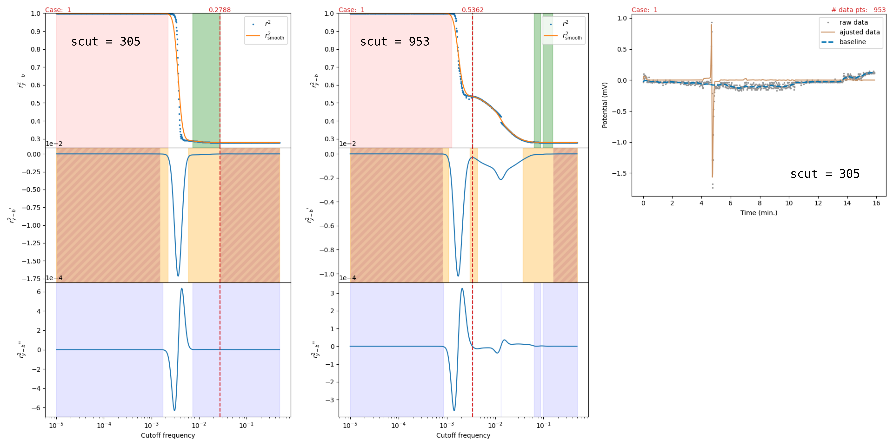

# How to find fcut?
In an autocorrelation plot of the baseline-corrected signal, a plateau represents a frequency range over which the baseline remains relatively unchanged, i.e., few or no “features” of the raw signal (in the broad sense) are designated as belonging to the baseline. According to Navarro-Huerta et al. \[[1](#navarro-huerta_assisted_2017)\], the optimal value of `fcut` lies on such a plateau. However, at this point it is not clear how to robustly detect the presence of a plateau, let alone how to identify the correct plateau. In general, the strategy we will use is:

> **What exactly is plotted, and two departures from the reference.** See [§0b](#0b-what-the-autocorrelation-measures) below. The reference paper defines *two* different plots, ours corresponds to the second, and our implementation departs from it on the quantity being autocorrelated and on the region it selects from. Both departures are recorded there; neither has been shown to be wrong, and one has been shown not to be worth fixing on the evidence available.
1. Identify plateaus in the autocorrelation plot;
2. Exclude plateaus that do not meet certain criteria, with the goal of identifying the plateau that includes the optimal value of `fcut`;
3. Find the optimal value of `fcut` on that plateau.

### 0b. What the autocorrelation measures

The quantity plotted is $`r^2 = \big((2 - DW)/2\big)^2`$, where $`DW`$ is the Durbin-Watson statistic — that is, approximately $`\rho_1^2`$, the squared lag-1 autocorrelation. It is therefore **not** a goodness of fit: it measures *how much smooth, structured content remains* in the channel it is computed on. $`r^2 \to 1`$ means what remains is strongly correlated point to point; $`r^2 \to 0`$ means it is white noise, i.e. nothing structured survives.

This has a consequence worth stating plainly, because it bounds what any plateau-based method can achieve. The drop in $`r^2`$ marks the cutoff at which the baseline starts absorbing the autocorrelated content of the measurement — but the statistic **cannot tell whether that content is analyte peaks or baseline structure**. For a strong analyte, crossing the drop destroys peak area and must be avoided; for a weak analyte on a large baseline (a blank), the structured content *is* the baseline, absorbing it is precisely the job, and a lower shelf beyond the drop can be the right answer. The information needed to choose is the ratio of analyte structure to baseline structure, which is *orthogonal to the curve*. Empirically this is exactly what is observed: on the labeled dataset, rules based on the shape of the $`r^2`$ curve select the correct `fcut` at 23–25%, against 25.9% for a random pick inside the candidate regions. **The curve brackets the answer; it does not select it.**

Two departures from Navarro-Huerta et al. \[[1](#navarro-huerta_assisted_2017)\] are worth recording. The paper defines two different plots: one on the BEADS **noise** $`e`$ on the original scale, whose *minimum* marks the optimum, and one on the **baseline-corrected signal** $`y - b = c + e`$ under the log transform, which gives a stepped plot. Only the second applies here, since the paper notes that the log transformation makes the returned noise unusable for the autocorrelation.

1. **The quantity.** `_r2` computes the statistic on `params["signal"]`, which is the sparse chromatogram $`c`$ alone — pybaselines documents it as the pure signal without noise or baseline. The paper's quantity is $`y - b = c + e`$, available exactly as `params["signal"] + params["noise"]` (equivalently $`z - b`$). The two differ substantially. Switching was tested against synthetic ground truth and **did not locate the optimum better** — on one of three test signals the current definition was clearly better — so the departure is documented rather than "fixed".
2. **The region.** The paper places the optimum near the centre of the *last* step at high frequencies, recommending in practice a point between the beginning and the centre of that last horizontal region. This implementation does the opposite: `last_r2` here, the frozen-tail exclusion in `trim_candidates` and the first-two-regions rule in `refine_candidates` all discard the final region and select from the first. On synthetic ground truth the paper's landmark missed the true optimum by roughly a factor of three on the clearest case, so this departure is deliberate and, so far, supported.

### 0. Preprocessing
Before searching for plateaus, the signal must be restricted to a region of interest. For instance, consider a raw signal with 11000 data points, where the clean signal is confined to the first 1000 points. If we include all points from the raw signal in the analysis, the autocorrelation will be biased because the contribution from the key components in the region of interest is diluted. Consequently, the autocorrelation plot often becomes noisier, hard to interpret and longer to compute.

In the current implementation, this occurs at the start of `auto_beads` via the `_relevant_regions` function. In short, if we assume that a raw signal consists of a baseline, noise, and a sparse signal component with a reasonable signal-to-noise ratio, then we can approximately locate the positions and widths of the signal peaks directly in the raw signal. This is (part of) what `_relevant_regions` is designed to do. For reference, this function is also used to identify the regions of interest and the sampling strategy for `custom_bc`. As of today, the signal is only truncated on the right (via `scut`), but not on the left. In the future, it may be advantageous to clip the signal on the left side as well.

### 1. Plateaus identification
> **Note:** a changepoint-based alternative to the plateau detection described below is prototyped in `segmentation.py` and documented in [segmentation.md](./segmentation.md).

In my view, plateau detection is the most challenging aspect of this problem. Up to now, the most effective approach I have found is to impose a small threshold around 0 on both the first (see the yellow \[loose tolerance\] and dashed orange regions \[tight tolerance\] on the [autocorrelation plot](#fig_scut)) and second derivatives (see the blue region on the [autocorrelation plot](#fig_scut)), and to mark as plateaus those points that fall within these tolerances. I experimented with several alternative techniques based on identifying features in the autocorrelation curve (for instance, inflection points or the extrema of its first derivative), but these approaches were too sensitive to the instabilities and discontinuities that can occur in the autocorrelation plot. A more robust method is therefore required in order to correctly identify all the plateaus.

### 2. Plateau exclusions
Regarding the regions to discard, let us first assume that there is always an “initial” plateau, `p_ini`, on the far left of the autocorrelation curve, i.e. where the `fcut` values are smallest. On this plateau, any choice of `fcut` yields a baseline that is overly rigid. In addition, when `fit_parabola` is set to True, the baseline begins to deform, much like a stiff beam under compression. Consequently, `p_ini` (in red on the [autocorrelation plot](#fig_scut)) is systematically excluded from the set of candidate plateaus. At present, this plateau is detected using a threshold on the drop of the `r2` value in reference to the average value of the first (from the left) tight flat region of the first derivative and by selecting the last point (before the minimum of the first derivative) that still satisfies this threshold. This approach allows us to better approximate the true end of the first plateau when it is very noisy. However, a more robust method is required.

If the last point (right side) of the autocorrelation is part of a continuous region where the first derivative is tightly flat, this last region is also not considered further through the use of `last_r2`.

At this point in time, there is no reliable way to find the "anchoring" plateau. In fact, this part of the code in more of less an artifact of an old implementation based on the use of extrema of the first derivative of autocorrelation.

### 3. Choosing the right `fcut` on a given plateau
Finally, once we assume that the correct plateau has been located, selecting `fcut` should be fairly straightforward, taking the plateau’s center and/or boundaries as references.

This last step is **the open half of the problem**, and it is harder than it looks. What is established so far, from the hand-labeled dataset and from synthetic signals with a known baseline:

- **Where the answer sits.** In log-relative position inside the first wide candidate region (0 = left edge, 1 = right edge), the hand-labeled ranges have their centre at 0.55 and their upper edge at 0.71, and the objectively optimal cutoff of the synthetic signals has a median of 0.65 with an interquartile range of 0.55–0.77. The two agree, which is the strongest signal available.
- **Not the edges.** Taking the right edge of the region — the natural reading of “anchor near the drop” — costs a median of 3.5× the optimal baseline error, roughly 19× the noise level, and lands within 1.25× of the optimum for only 8 of 71 synthetic signals. The interior matters.
- **Not a power law either.** `fcut` does scale with the peak width, strongly (R² 0.86 when nothing else varies), but the fitted exponent is −0.735 under full control, −0.88 on the synthetic benchmark and −0.50 on the real dataset. It is a property of the signal population, not a transferable law, so it is deliberately **not** used in production.
- **Blanks are the hard case, for a reason.** With no analyte peak there is no width to set the scale, and the structured content of the signal is the baseline itself, so the optimum can legitimately lie past the collapse. Which side of the collapse is correct is predicted by the analyte-to-baseline ratio at roughly 88–90% accuracy — enough to *gate* the decision, not enough to make it.

## References

1. Navarro-Huerta, J.A., et al. Assisted baseline subtraction in complex chromatograms using the BEADS algorithm. Journal of Chromatography A, 2017, 1507, 1-10. https://doi.org/10.1016/j.chroma.2017.05.057.
